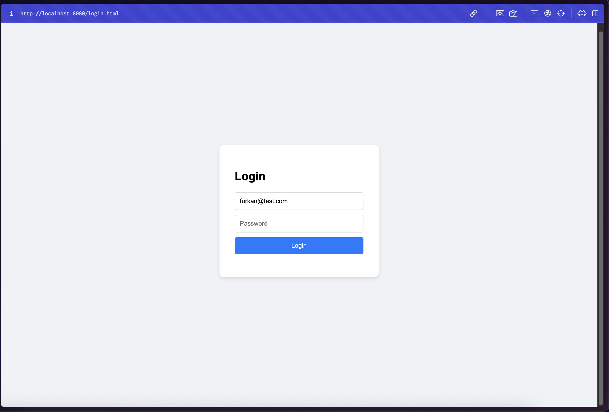
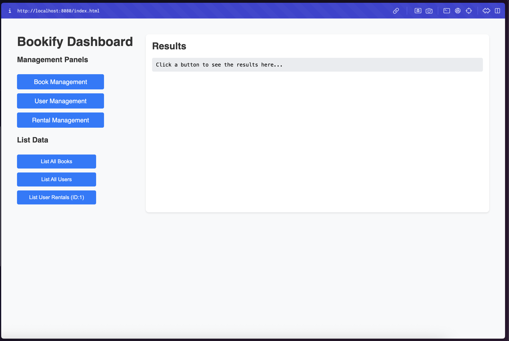
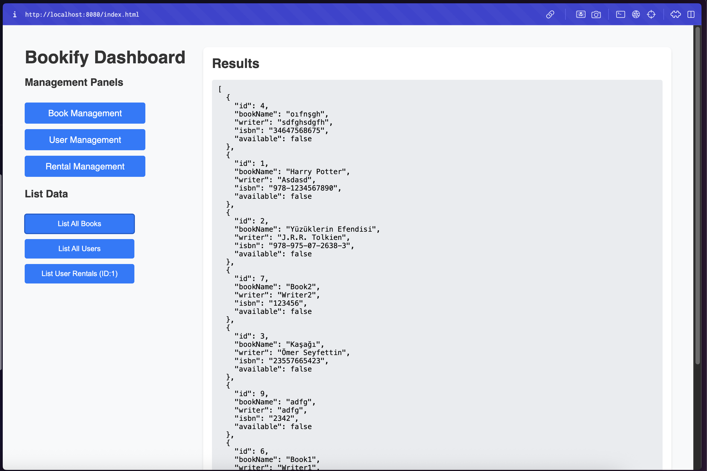
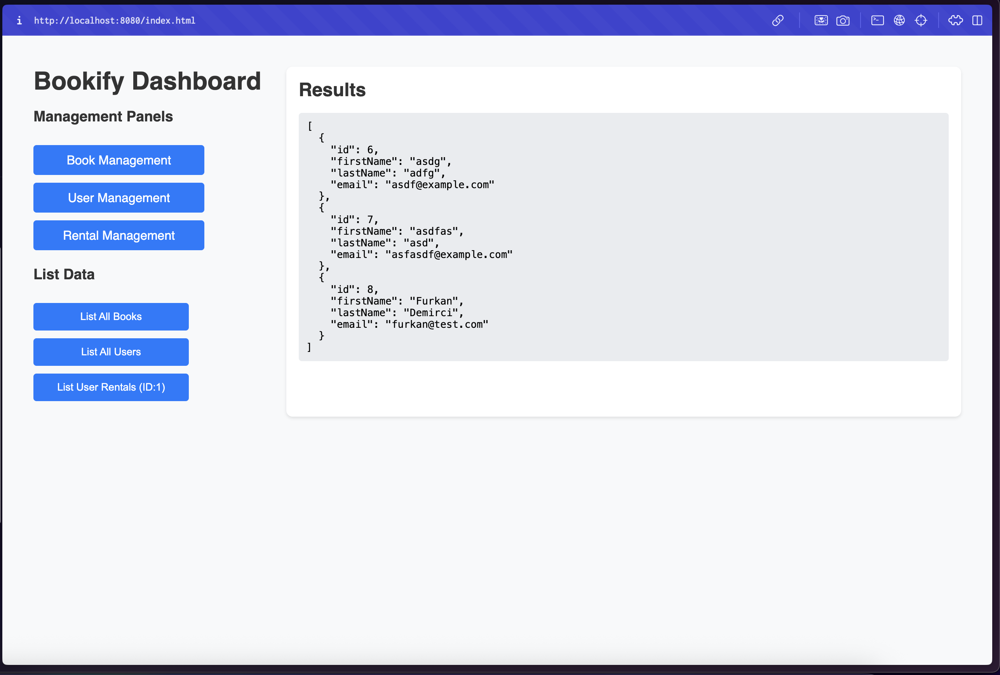
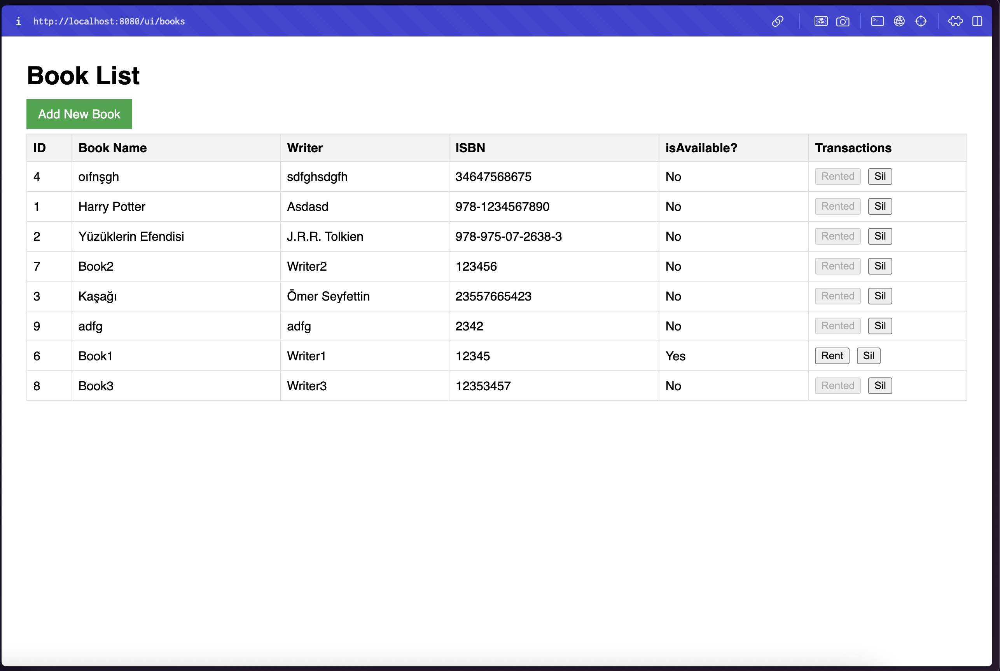
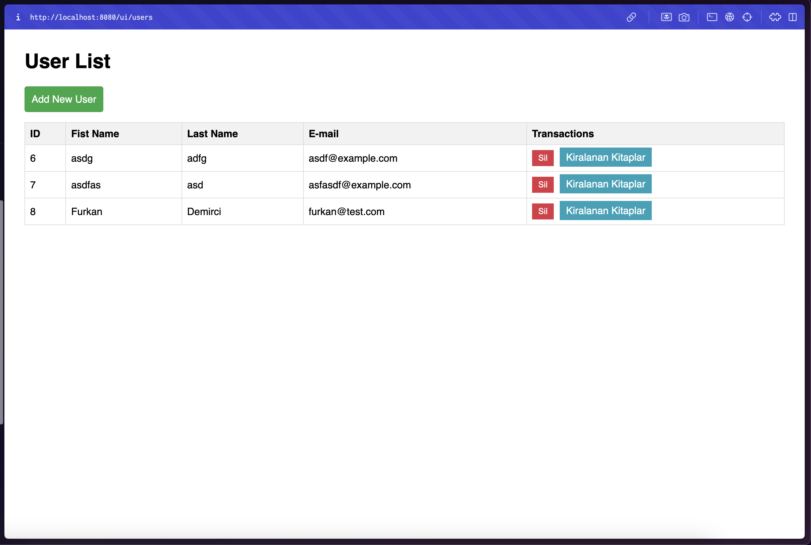
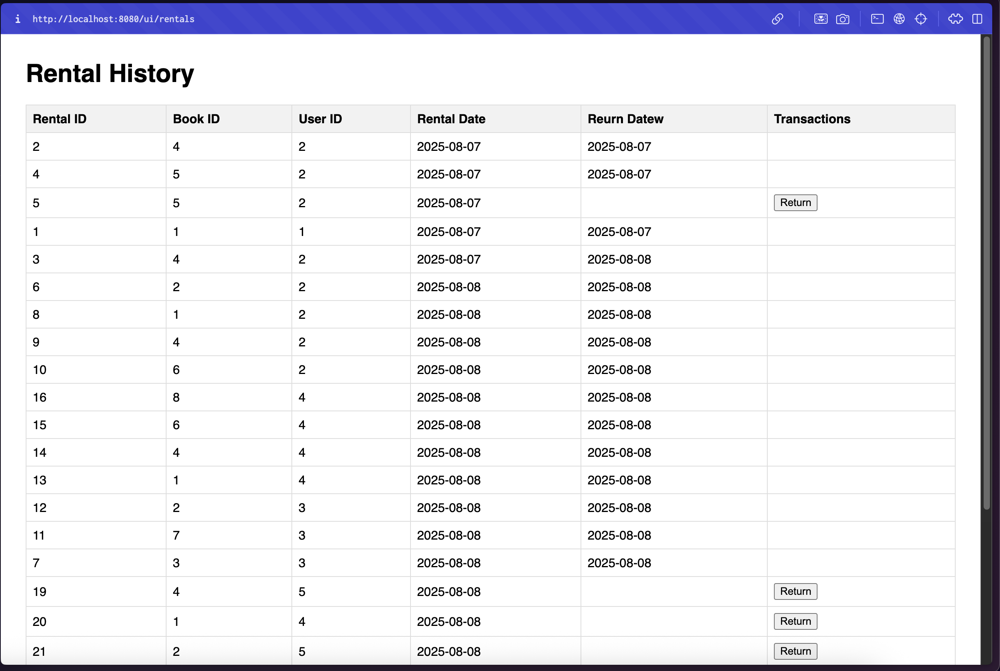

# Bookify - Kitap Kiralama Mikroservis Sistemi

## Proje Amacı

Bu proje, kullanıcıların kitap kiralayabileceği, kitap ve kullanıcı yönetimi yapabileceği bir mikroservis mimarisi uygulaması geliştirmeyi amaçlamaktadır. Sistem, temel CRUD işlemlerinin yanı sıra servisler arası iletişim, API gateway, config server, service discovery gibi bileşenlerini içerir.

## Kullanılan Teknolojiler

*   **Backend:**
    *   Java 17
    *   Spring Boot 3.4.0
    *   Spring Cloud (Eureka, Gateway, Config Server)
    *   Spring Data JPA
    *   PostgreSQL (Veritabanı)
    *   Lombok
    *   Spring Security (JWT)
*   **Frontend:**
    *   HTML, CSS
    *   Thymeleaf
*   **Test:**
    *   JUnit 5
    *   Mockito
*   **Diğer:**
    *   Maven (Bağımlılık Yönetimi)
    *   Postman / Swagger (API Testleri)
*   **IDE:** IntelliJ IDEA

## Mikroservis Mimarisi

Proje, aşağıdaki mikroservislerden oluşmaktadır:

1.  **User Service:** Kullanıcı kayıt ve yönetimi.
2.  **Book Service:** Kitap kayıt, yönetimi ve müsaitlik durumu takibi.
3.  **Rental Service:** Kitap kiralama ve iade işlemleri.
4.  **Auth Service:** Kimlik doğrulama ve JWT token yönetimi.
5.  **API Gateway:** Tüm API isteklerini yönlendirir, güvenlik, istek sınırlaması ve diğer çapraz kesim endişelerini yönetir.
6.  **Eureka Server (Service Registry):** Mikroservislerin birbirlerini bulmasını sağlar.
7.  **Config Server:** Servislerin yapılandırma ayarlarını merkezi olarak yönetir.

## Kurulum ve Çalıştırma

### Ön Koşullar

*   **Java 17 veya üzeri** yüklü olmalı.
*   **Maven** yüklü olmalı.
*   **PostgreSQL** veritabanı kurulu olmalı.

### Veritabanı Oluşturma

1.  PostgreSQL'de, aşağıdaki veritabanlarını oluşturun:
    *   `book_db`
    *   `user_db`
    *   `rental_db`

### Projeyi Derleme

1.  Proje dizininde (yani, `bookify-project` klasöründe) terminali açın.
2.  Aşağıdaki komutu çalıştırarak projeyi derleyin:

    ```bash
    mvn clean install
    ```

### Servisleri Çalıştırma

Servisler aşağıdaki sırayla başlatılmalıdır:

1.  **Eureka Server:** `cd eureka-server && mvn spring-boot:run` (Port: 8761)
2.  **Config Server:** `cd config-server && mvn spring-boot:run` (Port: 8888)
3.  **Auth Service:** `cd auth-service && mvn spring-boot:run` (Port: 8084)
4.  **User Service:** `cd user-service && mvn spring-boot:run` (Port: 8082)
5.  **Book Service:** `cd book-service && mvn spring-boot:run` (Port: 8081)
6.  **Rental Service:** `cd rental-service && mvn spring-boot:run` (Port: 8083)
7.  **API Gateway:** `cd api-gateway && mvn spring-boot:run` (Port: 8080)

---

## Uygulama Akışı ve Ekran Görüntüleri

### 1. Giriş İşlemi
Kullanıcı, `login` sayfası üzerinden kimlik bilgilerini girerek sisteme giriş yapar. Başarılı giriş sonrası JWT tabanlı bir `HttpOnly` cookie oluşturulur ve kullanıcı ana panele yönlendirilir.



### 2. Ana Dashboard
Giriş yapan kullanıcı, tüm yönetimsel işlemlerin ve listelemelerin merkezi olan Dashboard ekranı ile karşılaşır.



### 3. Dashboard Üzerinden Veri Listeleme
Dashboard üzerinden, API Gateway aracılığıyla farklı mikroservislerden (Book Service, User Service) veriler anlık olarak çekilip görüntülenebilir.

**Kitap Listesi:**


**Kullanıcı Listesi:**


### 4. Yönetim Panelleri
Dashboard üzerinden her servisin kendi Thymeleaf arayüzüne sahip yönetim paneline güvenli bir şekilde geçiş yapılır. Tüm bu geçişler API Gateway üzerinden doğrulanarak gerçekleşir.

**Kitap Yönetim Paneli (`/ui/books`)**


**Kullanıcı Yönetim Paneli (`/ui/users`)**


**Kiralama Yönetim Paneli (`/ui/rentals`)**


## API Endpoint'leri ve Swagger UI

*   API Gateway'in Swagger UI'ına erişmek için: `http://localhost:8080/swagger-ui/index.html`
*   **Auth Service API'ları:**
    *   `POST /api/auth/login` (Giriş yapar ve JWT/Cookie oluşturur)
    *   `POST /api/auth/register` (Yeni Kullanıcı Kaydı)
*   **User Service API'ları:**
    *   `GET /api/users` (Kullanıcıları Listeler)
    *   `GET /api/users/{userId}/rentals` (Kullanıcının Kiralamalarını Listeler)
*   **Book Service API'ları:**
    *   `GET /api/books` (Tüm kitapları listeler)
    *   `POST /api/books` (Yeni kitap ekler)
    *   `GET /api/books/{id}` (Kitap bilgisini ID'ye göre getirir)
*   **Rental Service API'ları:**
    *   `POST /api/rentals/rent` (Kitap kiralar)
    *   `PUT /api/rentals/{rentalId}/return` (Kitabı iade eder)
